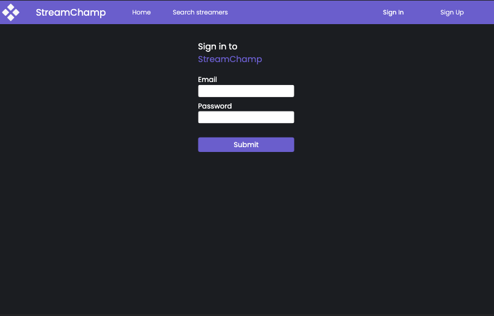
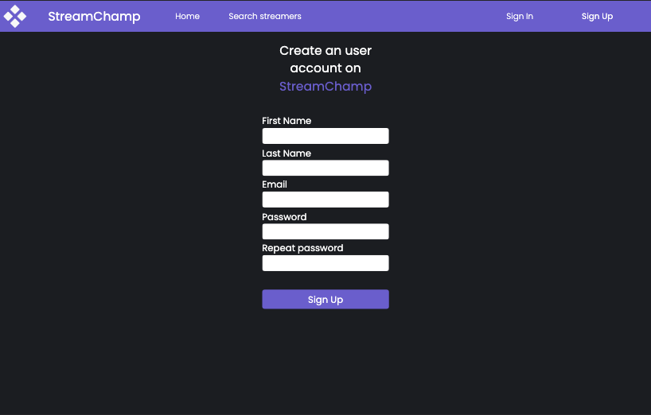
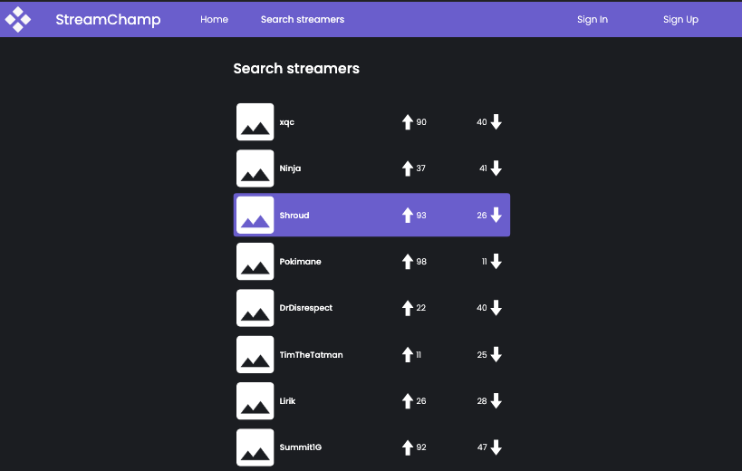
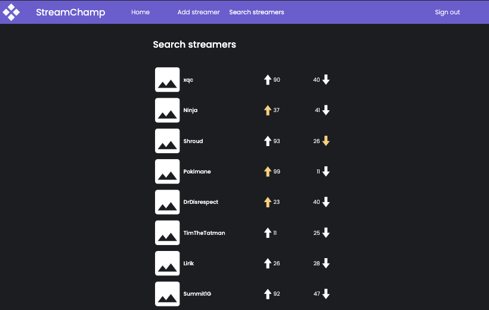
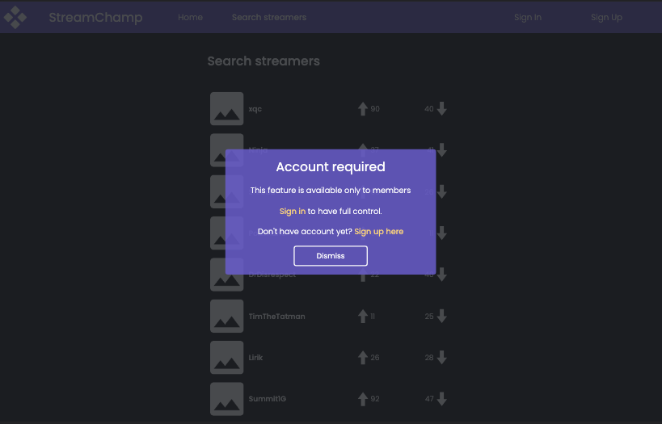
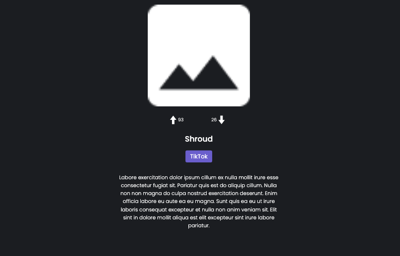
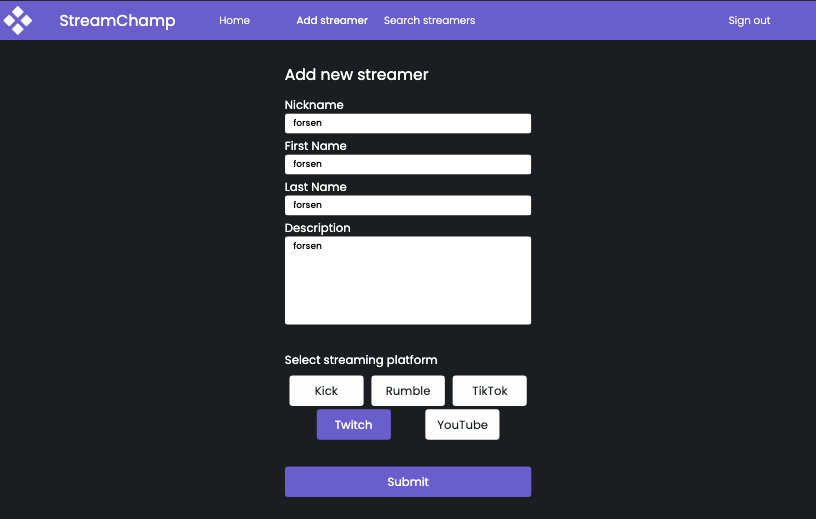

# StreamChamp a simple streamer spotlight application

## Description
This is a simple streamer spotlight application that allows users to post streamers and provides basic information such as nickname, description, and streaming platforms. Users can evaluate streamers by giving them upvotes or downvotes.

The application offers different features based on user roles. Some features are available to all users, while others require an account to access.

## Features
### Sign-in and Registration
Users can create an account by completing a simple sign-up form. This allows them to access additional features.

  
  

### Streamer Search
The application provides a view where users can search and browse through available streamers. The view includes a pagination mechanism to navigate through the streamer list efficiently. Users can also see the upvote and downvote count for each streamer and cast their own vote if they are signed in.

    
    
    

### Streamer Details
Clicking on a streamer's badge in Streamer Search view opens a dedicated page with details about the streamer. Users can explore additional information, such as the streamer's nickname, description and streaming platform they use.

### Add Streamer
The "Add Streamer" page is exclusively for signed-in users to contribute new streamers to the system. Users can fill out a form with the streamer's details, including their nickname, description, and streaming platforms. By submitting the form, the streamer will be added to the application, expanding the available options for other users to discover and evaluate.

### Vote tracking
Vote Tracking:
The application enables registered users to participate in the voting process for streamers. Each user has the option to upvote, downvote, or abstain from voting for a particular streamer. 

### Live updates
During the search process in the Streamer Search view and while exploring the dedicated details page of a specific streamer, users will experience real-time updates. These updates include live vote count changes for streamers and the addition of new streamers to the application.

## Technology stack
Javascript (Typescript) was used in both frontend and backend
- General
    - Typescript
    - Node
    - Socket.IO
    - Jest (testing)
- Frontend specific
    - React
    - Redux
    - Sass (SCSS) modules
- Backend specific
    - Express
    - SQLite3 (database)
    - Sequelize (ORM)

## How to start project?
This repository contains both frontend and backend for the application.
- To start server:
    - cd into `/backend` directory and run `npm install` to install dependencies
    - run `npm start` in order to start server in development mode

- To start frontend app
    - cd into `/frontend` and run `npm install` to install dependencies
    - run `npm run dev` in order to start app in development mode and enter address (printed in console) in browser

<b>NOTE</b> By default backend runs on `localhost:8080` and frontend dev server on `localhost:5173`

